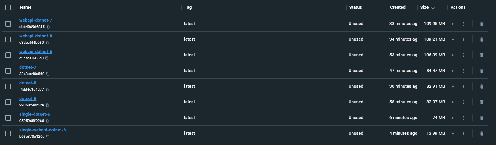

# DockerImageSizeComparison

Docker Image Size Comparison

## Comparison

| Target Framework | Single/Self-Contained | OS | Type | Size |
|:----------------:|:---------------------:|:--:|:----:|:----:|
| net6.0 | True | Alpine 3.18 | Console | 71.45 MB (Can't running! Need modification.) |
| net6.0 | False | Alpine 3.18 | Console | 82.7 MB |
| net6.0 | True | Alpine 3.18 | Web API | 11.4 MB (Can't running! Need modification.) |
| net6.0 | False | Alpine 3.18 | Web API | 106.39 MB |
| net7.0 | False | Alpine 3.18 | Console | 84.47 MB |
| net7.0 | False | Alpine 3.18 | Web API | 109.95 MB |
| net8.0 | False | Alpine 3.18 | Console | 82.91 MB |
| net8.0 | False | Alpine 3.18 | Web API | 109.21 MB |

### Evidence



## Methodology

1. Build Image
2. Check Size
3. Run the Image (Should running!)

## TODO

1. Automatically Generate the Size.
2. Automatically Validate the applications.
3. Setting dependencies for Self Contained.

## Known Errors

```bash
2023-06-30 09:48:31 Error loading shared library libgcc_s.so.1: No such file or directory (needed by ./SingleConsoleNet6)
2023-06-30 09:48:31 Error loading shared library libstdc++.so.6: No such file or directory (needed by ./SingleConsoleNet6)
```